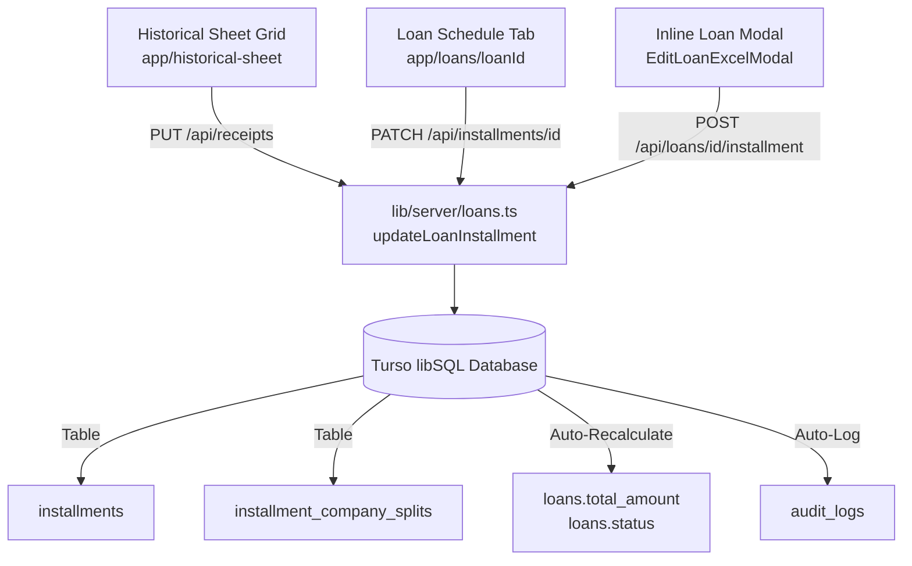

# ASR Groups Finance ERP — Architecture Documentation

## 1. System Overview

**ASR Groups Finance ERP** is an enterprise multi-role financial syndication, underwriting, repayment tracking, and administrative governance system built for private lending portfolios.

The application is architected around Next.js App Router, Turso libSQL (distributed SQLite), React 19, TypeScript, and Tailwind CSS.

---

## 2. Directory Structure & Organization

```
asr-groups/
├── app/                                # Next.js App Router (Routes, Pages & Colocated Components)
│   ├── layout.tsx                      # Root HTML layout with Ubuntu typography
│   ├── page.tsx                        # Main ERP entry point & interactive shell
│   ├── globals.css                     # Design tokens, color system, and utilities
│   │
│   ├── dashboard/                      # Route: /dashboard
│   │   ├── page.tsx                    # Executive Financial Command Center page
│   │   └── _components/                # Colocated dashboard components
│   │       └── DashboardView.tsx
│   │
│   ├── loans/                          # Route: /loans
│   │   ├── page.tsx                    # Loans list & portfolio aggregated grid page
│   │   ├── [loanId]/                   # Route: /loans/[loanId]
│   │   │   └── page.tsx                # Loan details & repayment schedule page
│   │   └── _components/                # Colocated loan components
│   │       ├── LoansListView.tsx
│   │       ├── LoanDetailsView.tsx
│   │       ├── EditLoanExcelModal.tsx
│   │       └── new-loan/               # Modular 5-Step Loan Creation Flow
│   │           ├── NewLoanModal.tsx    # Step container modal (NO "wizard" terms)
│   │           └── steps/
│   │               ├── BorrowerStep.tsx    # Step 1: Client selection / creation
│   │               ├── TermsStep.tsx       # Step 2: Frequency, EMIs & start date
│   │               ├── CompaniesStep.tsx   # Step 3: Funding company splits
│   │               ├── ScheduleStep.tsx    # Step 4: Installment balancing grid
│   │               └── ReviewStep.tsx      # Step 5: Syndication review & submit
│   │
│   ├── customers/                      # Route: /customers
│   │   ├── page.tsx                    # Borrower directory page
│   │   ├── [customerId]/               # Route: /customers/[customerId]
│   │   │   └── page.tsx                # Borrower profile page
│   │   └── _components/                # Colocated customer components
│   │       ├── CustomersListView.tsx
│   │       ├── CustomerDetailsView.tsx
│   │       └── AddCustomerModal.tsx
│   │
│   ├── companies/                      # Route: /companies
│   │   ├── page.tsx                    # Funding partner entities page
│   │   ├── [companyId]/                # Route: /companies/[companyId]
│   │   │   └── page.tsx                # Entity portfolio allocations page
│   │   └── _components/                # Colocated company components
│   │       ├── CompaniesListView.tsx
│   │       ├── CompanyDetailsView.tsx
│   │       └── AddCompanyModal.tsx
│   │
│   ├── historical-sheet/               # Route: /historical-sheet
│   │   ├── page.tsx                    # July 2026 721-EMI spreadsheet grid page
│   │   └── _components/
│   │       └── HistoricalSheetView.tsx # Full editable ledger grid
│   │
│   ├── schedule/                       # Route: /schedule
│   │   ├── page.tsx                    # Operational calendar & collection schedules page
│   │   └── _components/
│   │       └── ScheduleView.tsx
│   │
│   ├── administration/                 # Route: /administration
│   │   ├── page.tsx                    # Admin hub overview page
│   │   ├── users/
│   │   │   ├── page.tsx                # User accounts management page
│   │   │   └── [userId]/
│   │   │       └── page.tsx            # User profile & session details page
│   │   ├── roles/
│   │   │   └── page.tsx                # Role hierarchy & permissions page
│   │   ├── audit-log/
│   │   │   └── page.tsx                # Immutable compliance audit trail page
│   │   ├── settings/
│   │   │   └── page.tsx                # Shareholders equity & system configs page
│   │   └── _components/                # Colocated administration tabs & modals
│   │       ├── AdminSection.tsx
│   │       ├── OverviewTab.tsx
│   │       ├── UserManagementTab.tsx
│   │       ├── UserDetailsView.tsx
│   │       ├── RolesPermissionsTab.tsx
│   │       ├── PermissionMatrixTab.tsx
│   │       ├── ApprovalRulesTab.tsx
│   │       ├── AuditLogTab.tsx
│   │       ├── SystemSettingsTab.tsx
│   │       └── modals/ (CreateUserModal, SuspendUserModal, EditRoleModal, etc.)
│   │
│   ├── settings/                       # Route: /settings
│   │   └── page.tsx                    # Top-level settings route
│   │
│   └── api/                            # Thin REST API Routes (Delegates to lib/server)
│       ├── loans/ (and [id], [id]/installment)
│       ├── installments/[installmentId]/
│       ├── receipts/
│       ├── customers/
│       ├── companies/
│       ├── dashboard/
│       └── admin/ (users, roles, permissions, rules, audit, settings, backup)
│
├── components/                         # STRICTLY SHARED REUSABLE COMPONENTS ONLY
│   ├── ui/                             # Design System Generic Primitives
│   │   ├── DataTable.tsx               # Reusable paginated & searchable data table
│   │   ├── DateRangePicker.tsx         # Reference Date Range Picker with presets
│   │   ├── StatCard.tsx                # Metric KPI card
│   │   ├── StatusPill.tsx              # Standardized status badge
│   │   ├── RoleBadge.tsx               # Role badge with custom colors & icons
│   │   ├── CompanySplitBadge.tsx       # Company badge with popover contribution
│   │   ├── Toast.tsx                   # Toast notification system
│   │   └── UnderDevelopmentView.tsx    # Fallback for future modules
│   │
│   └── layout/                         # Global Application Layout
│       ├── AppShell.tsx                # Responsive multi-pane wrapper
│       ├── Sidebar.tsx                 # Left navigation with role-permission filter
│       ├── TopNav.tsx                  # Top header, breadcrumbs & persona switcher
│       └── RoleRibbon.tsx              # Simulated role banner
│
├── lib/                                # Core Business Logic, State & Services
│   ├── types.ts                        # TypeScript interfaces & domain models
│   ├── store.tsx                       # React Context Store (`useApp`) & API sync
│   ├── seedData.ts                     # System roles, default settings & matrices
│   │
│   ├── server/                         # Server & Database Layer (libSQL Turso)
│   │   ├── turso.ts                    # Singleton Turso Client connection factory
│   │   ├── schema.ts                   # Table DDL definitions & schema migrations
│   │   ├── loans.ts                    # Loans, installments & historical DB logic
│   │   ├── customers.ts                # Customers DB queries & mutations
│   │   ├── companies.ts                # Companies DB queries & mutations
│   │   ├── administration.ts           # Users, Roles, Matrix, Rules & Audit DB logic
│   │   └── db.ts                       # Unified facade re-exporting domain modules
│   │
│   ├── calculations/                   # Pure Calculation & Math Utilities
│   │   ├── splitCalculations.ts        # Company percentages, auto-balance & checks
│   │   └── portfolioMetrics.ts         # Lifetime vs Period-scoped metric engines
│   │
│   └── utils/                          # General Shared Utility Functions
│       ├── formatCurrency.ts           # Indian Rupee (`₹`) formatting & parsing
│       └── statusMapping.ts            # Taxonomy mappings (Settled, Bounced, etc.)
│
├── public/                             # Static Assets (Logos, Icons, Images)
├── .env                                # Environment variables (Turso credentials - strictly git-ignored)
└── ARCHITECTURE.md                     # This document
```

---

## 3. Data Architecture: Unified Installment Data Path

Both **Historical Sheet** (`/historical-sheet` / 721 EMIs) and **Loan Repayment Schedule** (`/loans/[loanId]`) read and write the **exact same underlying Turso database rows**.



---

## 4. Verification & Build Standard

All changes in the codebase are verified by:
```bash
# TypeScript verification
npx tsc --noEmit

# Production Next.js build
npm run build
```
*(All 28 routes build statically/dynamically with 0 errors).*
